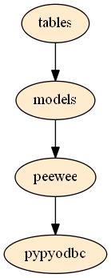

.. DCPyDB documentation master file, created by
   sphinx-quickstart on Fri Feb 27 13:21:00 2015.
   You can adapt this file completely to your liking, but it should at least
   contain the root `toctree` directive.

DC Py Database Tool
===================

This tool is written by python and used to auto generate data and insert into database for DC project.

Contents:
---------

.. toctree::
   :maxdepth: 2
   :glob:

   api

索引和搜索
==================

* :ref:`genindex`
* :ref:`modindex`
* :ref:`search`

