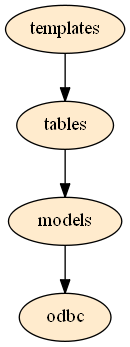

.. _overview:

Overview
========

This tool is written in Python, it can be divided into 4 levels.

1. **ODBC** - This layer executes SQL directly through ODBC interface. It is 3rd party module called pypyodbc.

2. **Models** - This layer is based on 3rd party module "peewee". Peewee is a lightweight ORM for SQLite and MySQL, so need to change source code to support MS Access Database. Models define all tables and fields in MS database. 

3. **Tables** - This layer is encapsulated operation classes for models. It can handle relationship between models like convert foreign fields and some operations like add, update database.

4. **Templates** - This layer is combined with different tables, so they can present some specific gui components in DisplayFactory.mdb, strings in Language.mdb or data in Factory.mdb.
