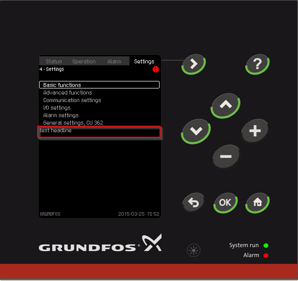

.. _quickstart:

Quickstart
==========

This document presents a brief, high-level overview of DC Database Helper features. This guide will cover:

I **strongly** recommend opening an interactive shell session and running the code. That way you can get a feel for typing in queries.

Example
-------

Here is a simple example to show how to use this tool. We want to add one label in **4. Settings screen**.

1. Create new py file in scripts\\feature as example.py and then add below code in this file.

.. code-block:: python

    # -*- coding: utf-8 -*-
    from ..template.tpl import template
    from ..util.log import *
    
    def example():
        comment('This is an example')
        t = template('LabelHeadline')
        t.description = '---------- Add headline text in 4. Settings ----------'
        t.label_name = '4. test headline'
        t.define_name = 'SID_TEST_HEADLINE'
        t.string = 'test headline'
        t.listview_id = '4. Settings List 1'
        t.save()

2. Open run.py and modify it as below:

.. code-block:: python

    # -*- coding: utf-8 -*-
    from scripts.misc import copy_database, run_generators, ghs_build, vc_build
    from scripts.tables import *
    from scripts.feature.example import example
    
    if __name__ == '__main__':
        example()
        run_generators()
        vc_build()
        
3. Run run.py in windows command.

.. code-block:: console

    python run.py

Elaborate 
---------

**example.py**

.. code-block:: python

    from ..template.tpl import template
    from ..util.log import *

1. There are a lot of templates in template directory, so the first step is import this module. And we also import log module because we need to output some log.

.. code-block:: python

    def example():
        comment('This is an example')
        t = template('LabelHeadline')

2. We create new function named ``example()``. In this function, we call ``comment()`` firstly so that it can output some comment in console. Then use ``template()`` we can get an instance of template. Here the instance is from **LabelHeadline**. Please read :ref:`template <template>` to get more details of templates.

.. code-block:: python

        t.description = '---------- Add headline text in 4. Settings ----------'
        t.label_name = '4. test headline'
        t.define_name = 'SID_TEST_HEADLINE'
        t.string = 'test headline'
        t.listview_id = '4. Settings List 1'

3. After creating new instance from template, we need set some attributes for this instance. Here are some explanation of attributes: 

+-------------+--------------------------------------------------------+
| attribute   | explanation                                            |
+=============+========================================================+
| description | Add some description to output, it is optional         |
+-------------+--------------------------------------------------------+
| label_name  | define new component name in DisplayComponent table    |
+-------------+--------------------------------------------------------+
| define_name | string define name in StringDefines table, all capital |
+-------------+--------------------------------------------------------+
| string      | the string which want to show on screen                |
+-------------+--------------------------------------------------------+
| listview_id | the listview id where the new added text belongs       |
+-------------+--------------------------------------------------------+

.. code-block:: python

        t.save()

4. Finally, we should invoke the ``save()`` function to insert data into database.

**run.py**

.. code-block:: python

    # -*- coding: utf-8 -*-
    from scripts.misc import copy_database, run_generators, ghs_build, vc_build
    from scripts.tables import *
    from scripts.feature.example import example
    
5. In run.py, import the example module we just created.

.. code-block:: python

    if __name__ == '__main__':
        example()
        run_generators()
        vc_build()

6. In the main entry, we use ``example()`` to insert database, ``run_generators()`` to run factory, languange, web generators, and then use ``vc_build()`` to build vc project 'cu3x1AppPcSim_SRC\PcMrViewer\pc.sln'.
